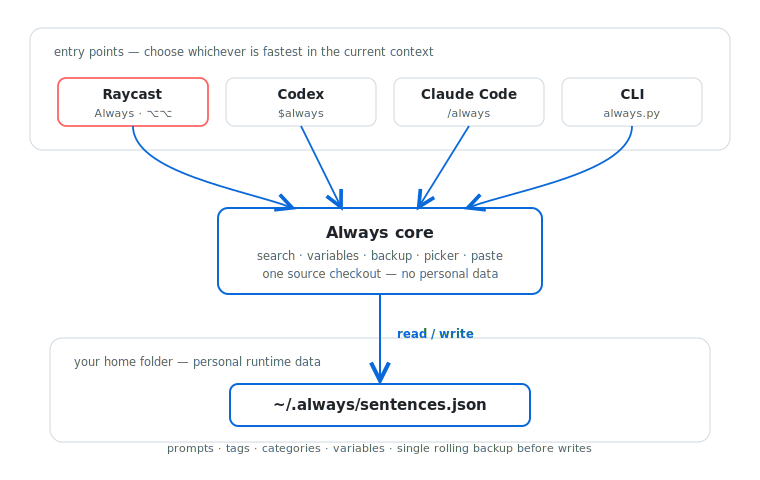

<div align="center">

# Always

[English](README.md) | [中文](README.zh.md)

> *好用的指令，不应该在每次对话里重新写一遍。*

**给 Codex 和 Claude Code 共用的个人常用句选择器。**

[](LICENSE) [](#运行要求) [](https://code.claude.com/docs/en/skills) [](https://developers.openai.com/codex/skills) [](#原生选择器与粘贴)

**一份 `~/.always/sentences.json`，让两个 Agent 共用你的提示词、写作偏好、审查要求和带变量模板。**

[30 秒开始](#30-秒开始) · [日常用法](#日常用法) · [管理常用句](#管理你的常用句库) · [CLI 命令](#cli-命令参考) · [项目详解](项目详解.md) · [隐私与安全](#隐私与安全)

</div>

---

很多指令会反复出现：先规划再写代码、审查某个文件、用特定口吻回答、完成前必须验证。Always 让你把这些要求保存一次，然后在 Codex 和 Claude Code 里共同使用。选一句、补变量、按需要修改，最后仍由你自己发送。

## 工作原理

<picture>
  <source media="(prefers-color-scheme: dark)" srcset="assets/architecture-dark.svg">
  <source media="(prefers-color-scheme: light)" srcset="assets/architecture-light.svg">
  
</picture>

仓库保存 Skill 和 CLI；安装脚本用两个软链接把同一份 Skill 暴露给 Codex 与 Claude Code。你的真实内容独立保存在 `~/.always/sentences.json`，所以更新仓库代码不会覆盖个人常用句。

## 30 秒开始

```bash
git clone https://github.com/ycl-2004/Always.git
cd Always
scripts/install.sh
```

然后在 Codex 输入：

```text
$always
```

在 Claude Code 输入：

```text
/always
```

macOS 会弹出原生选择窗口。选中一条后，Always 会把它粘贴到当前输入框，但不会按 Enter。你可以先修改，再自己发送。

> [!NOTE]
> 原生选择器和自动粘贴只支持 macOS。列出、搜索、打印和管理常用句走 Python CLI，不依赖 GUI 自动化。

## 你会得到什么

- 一份由 Codex 与 Claude Code 共用的个人常用句库。
- 支持预先搜索过滤的 macOS 原生选择器。
- 分类、标签、多语言正文和 `{变量}` 占位符。
- 列出、搜索、选择、新增、修改、删除的完整 CLI。
- 每次受管写入前保留一份上一版本备份。
- 不需要云服务、账号、API Key 或第三方 Python 包。

## 安装

在源码仓根目录运行：

```bash
scripts/install.sh
```

脚本会创建：

```text
~/.agents/skills/always  -> <仓库>/skills/always
~/.claude/skills/always -> <仓库>/skills/always
```

如果真实数据库还不存在，它还会从 sample 初始化：

```text
~/.always/sentences.json
```

安装器不会自动替换已经存在的非软链接目录。遇到冲突时，需要你先自行移动或删除旧目录，再重新运行安装脚本。

### 更新 Always

两个 Agent 都通过软链接使用源码仓，所以只需更新源码仓：

```bash
git pull --ff-only
```

正常更新不会覆盖 `~/.always/sentences.json`。

### 卸载

删除两个 Skill 软链接：

```bash
rm ~/.agents/skills/always
rm ~/.claude/skills/always
```

个人常用句仍然保留在 `~/.always/`。只有在你确认不再需要这些内容时，才单独删除该目录。

## 日常用法

| 操作 | Codex / Claude 指令 | 结果 |
|---|---|---|
| 打开全部常用句 | `$always` / `/always` | 打开选择器并粘贴所选内容。 |
| 先过滤 | `$always review` | 只显示匹配项。 |
| 只列出、不粘贴 | `$always 列出我现在的常用句` | 输出可读列表。 |
| 新增 | `$always 新增一条常用指令……` | 写入一条新记录。 |
| 修改 | `$always 修改 chinese-human-tone……` | 按 ID 更新记录。 |
| 删除 | `$always 删除 explain-simply` | 先确认，再删除。 |

不同客户端的显式入口可能略有差异，但 Skill ID 始终是 `always`。

## 原生选择器与粘贴

最直接的 CLI 用法是：

```bash
python3 skills/always/scripts/always.py menu
```

完整流程：

1. AppleScript 打开原生 `choose from list` 窗口。
2. 如果正文里存在未填写的 `{变量}`，继续弹窗收集。
3. 使用 `pbcopy` 把渲染后的内容放入剪贴板。
4. System Events 向当前最前方应用发送 `Cmd+V`。
5. 不会自动按 Enter；内容必须由用户确认后发送。

macOS 可能要求给 Terminal、Raycast、Codex 或其他启动脚本的应用开启“辅助功能”权限。如果自动粘贴失败，内容仍在剪贴板里，同时 CLI 会把文本打印出来。

## 管理你的常用句库

推荐通过 CLI 或让 Agent 调用 CLI 管理。直接修改 JSON 虽然可行，但会绕过备份与部分校验。

### 查看和搜索

```bash
python3 skills/always/scripts/always.py list
python3 skills/always/scripts/always.py search "中文 写作"
```

搜索不区分大小写，会检查 ID、标题、正文、分类、语言和标签。多个关键词采用 AND 关系；这是子字符串过滤，不是模糊搜索或相关度排序。

### 新增

交互式：

```bash
python3 skills/always/scripts/always.py add
```

一次写完：

```bash
python3 skills/always/scripts/always.py add \
  --id analyze-first \
  --title "先分析再执行" \
  --text "先检查相关文件和约束，再开始修改。" \
  --category planning \
  --language zh \
  --tag 分析 \
  --tag 上下文
```

ID 会被标准化为小写 ASCII slug，而且必须唯一。如果标题全部是中文，需要显式提供英文或数字组成的 `--id`。

### 修改

```bash
python3 skills/always/scripts/always.py edit analyze-first
```

交互过程中直接按 Enter 会保留原值。如果提供一个或多个 `--tag`，会用新标签列表替换原有标签。

### 删除

```bash
python3 skills/always/scripts/always.py delete analyze-first
```

默认必须输入 `yes`。`--force` 会跳过确认，只建议在受控自动化里使用。

## 变量模板

占位符使用花括号：

```text
Review {file} carefully. Focus on {concern}.
```

原生选择器会自动询问缺少的变量。CLI 也可以预先传入：

```bash
python3 skills/always/scripts/always.py get review-focus \
  --var "file=README.md" \
  --var "concern=安装说明是否准确" \
  --paste
```

## CLI 命令参考

| 命令 | 用途 |
|---|---|
| `seed` | 从 sample 创建数据库；`--force` 会先备份再重置已有数据库。 |
| `list [query]` | 列出全部或匹配的记录。 |
| `search [query]` | 搜索所有支持的字段。 |
| `get <id>` | 按精确 ID 打印或粘贴一条记录。 |
| `pick [query]` | 搜索后用编号选择，再打印或粘贴。 |
| `menu [query]` | 打开 macOS 原生选择器；默认粘贴。 |
| `add` | 交互式或通过参数新增。 |
| `edit <id>` | 修改或重命名现有记录。 |
| `delete <id>` | 确认后删除记录。 |

查看某个命令的完整参数：

```bash
python3 skills/always/scripts/always.py menu --help
python3 skills/always/scripts/always.py edit --help
```

## 数据结构

真实数据库位于：

```text
~/.always/sentences.json
```

每条记录包含：

```json
{
  "id": "review-focus",
  "title": "Review with focus",
  "text": "Review {file} carefully. Focus on {concern}.",
  "category": "review",
  "tags": ["review", "risk"],
  "language": "en",
  "created_at": "2026-06-29T00:00:00Z",
  "updated_at": "2026-06-29T00:00:00Z"
}
```

每次新增、修改或删除之前，旧数据库会复制到：

```text
~/.always/sentences.backup.json
```

它只有一代，是滚动备份，不是完整版本历史。

## 仓库结构

```text
Always/
├── README.md
├── README.zh.md
├── PROJECT_DETAILS.md
├── 项目详解.md
├── LICENSE
├── assets/
│   ├── architecture-light.svg
│   └── architecture-dark.svg
├── scripts/
│   └── install.sh
└── skills/always/
    ├── SKILL.md
    ├── agents/openai.yaml
    ├── assets/sentences.sample.json
    └── scripts/always.py
```

## 验证

在仓库根目录运行：

```bash
python3 -m py_compile skills/always/scripts/always.py
bash -n scripts/install.sh
python3 skills/always/scripts/always.py --help
```

如果要测试写入流程，把 `HOME` 临时指向测试目录，再运行 `seed`、`add`、`edit` 和 `delete`。除非确定要重置真实常用句库，否则不要在真实 HOME 下运行 `seed --force`。

## 隐私与安全

- 常用句以明文 JSON 保存在本机，不要存储密钥、Token、密码或私钥。
- 原生粘贴以“当前最前方应用”为目标；选择之前要确保焦点在正确输入框。
- 备份与主数据库位于同一块磁盘，不构成灾难恢复方案。
- 当前没有多进程写锁，不要同时执行多个新增、修改或删除操作。
- `seed --force` 会先写滚动备份，再用 sample 覆盖真实数据库。
- 移动源码仓后，两个 Skill 软链接会失效，需要在新路径重新运行 `scripts/install.sh`。

## 运行要求

| 依赖 | 用途 | 说明 |
|---|---|---|
| Python 3.10+ | 全部 CLI 操作 | 只使用标准库。 |
| macOS | 原生选择器与自动粘贴 | 使用 AppleScript、`pbcopy` 和 System Events。 |
| Bash | 安装脚本 | macOS 和多数 Linux 系统自带。 |
| 辅助功能权限 | 自动发送 `Cmd+V` | 只打印文本时不需要。 |

## 项目详解

完整机制、能力边界、取舍、风险和维护者地图见 [项目详解.md](项目详解.md)。英文版见 [PROJECT_DETAILS.md](PROJECT_DETAILS.md)。

## 参与贡献

欢迎提交 Issue 和 Pull Request。优先方向包括：自动化测试、更多平台适配、更严格的数据结构校验、更安全的并发写入，以及选择器体验改进。核心原则保持不变：本地、可读、可编辑，并且最终发送权始终属于用户。

## License

[MIT](LICENSE) © 2026 yc星辰

---

<div align="center">

*写一次，在每个 Agent 对话里随时调用。*

</div>
